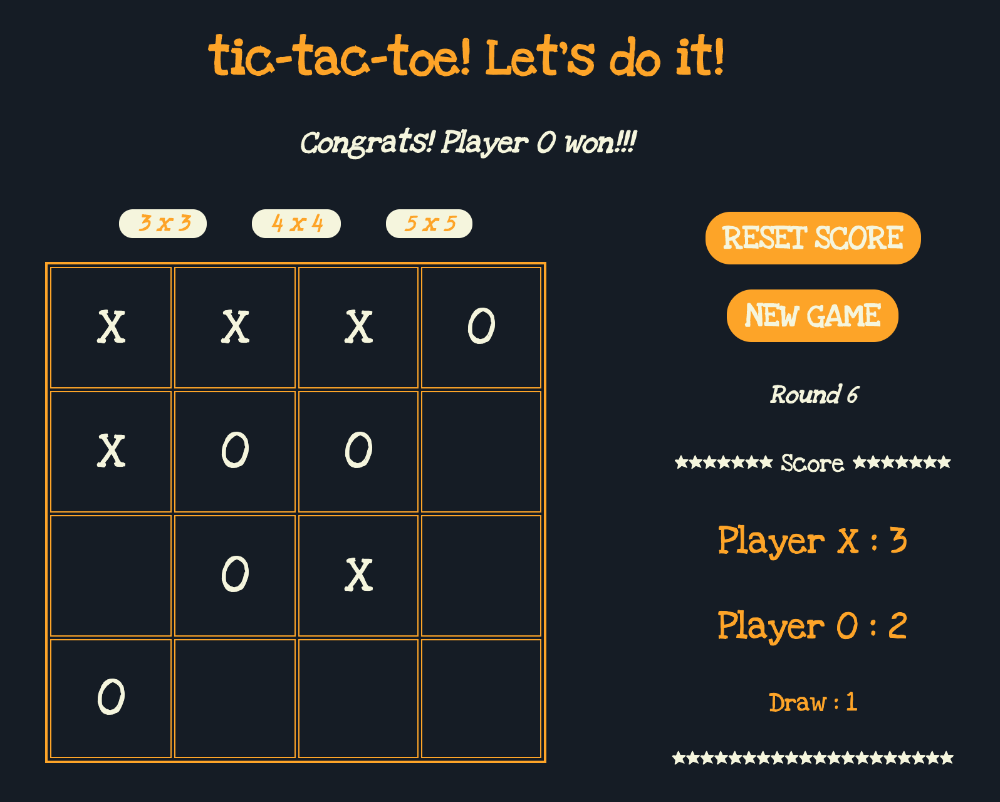

# __tic-tac-toe__

It's a classic tic-tac-toe game with neat design.

Get straight to the game
[here](https://viola-hu.github.io/tic-tac-toe/), or click this link:
https://viola-hu.github.io/tic-tac-toe/

## __How it looks__

## __How to play__
- 3x board scale options
- players can change scale anytime during the game (If one round of game is over, changing scale will automatically start a new round.)
- game starts from player X, and two players X and O take turns to choose an available space by clicking on it
- a prompt message will pop up in below situations:
 * clicks on an occupied space
 * congrats on winner
 * draw
 * clicks on board after a round completes
- start a new round of game by click NewGame button
- each player's score and draw number are recorded

## __Built with__
- HTML
- CSS
- Javascript
- jQuery

## __To Do__
- [ ] add a reset score feature, instead of manually refreshing page at the moment
- [ ] add feature of choosing avatars
- [ ] add feature to let players decide who plays first
- [ ] it's thoughtful to add prompt showing whose turn it is now
- [ ] add AI feature, i.e. player vs computer
- [ ] add CSS animation features
